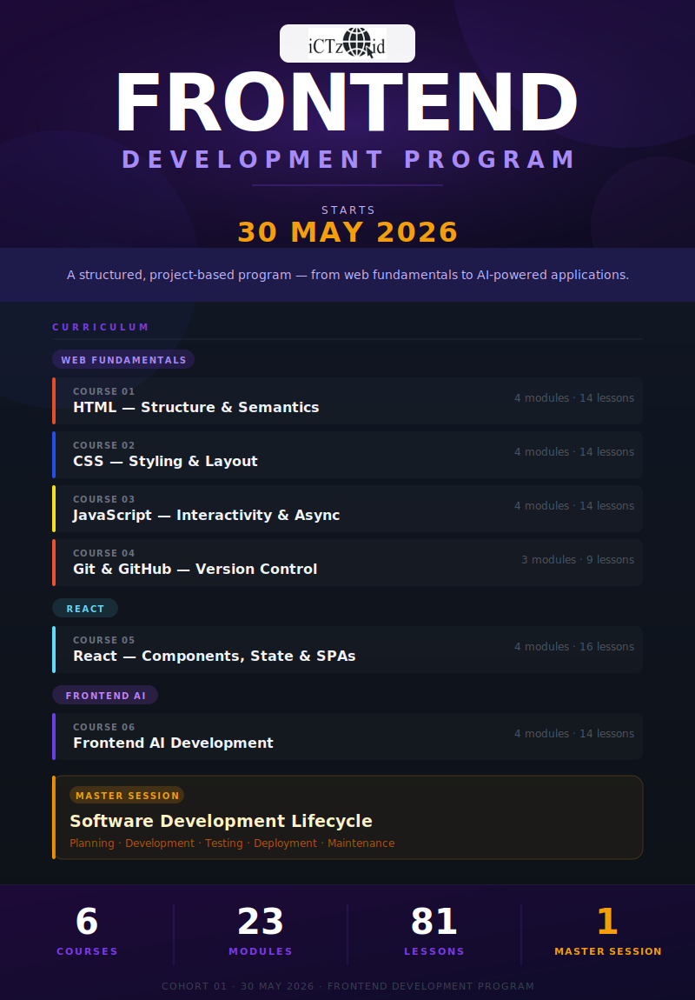
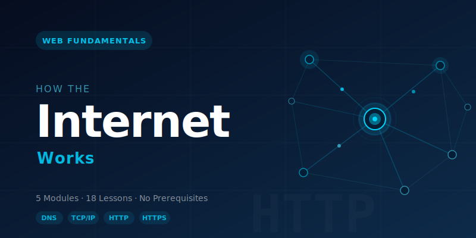
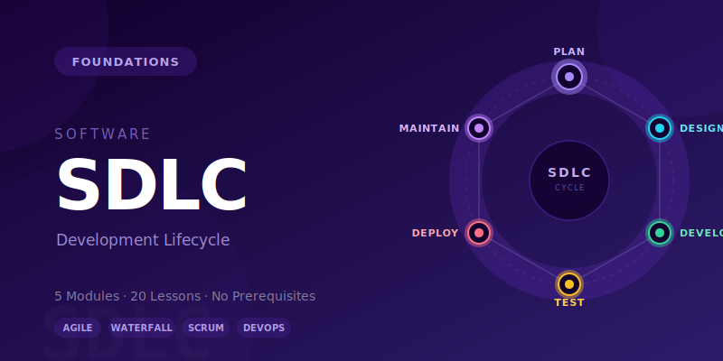
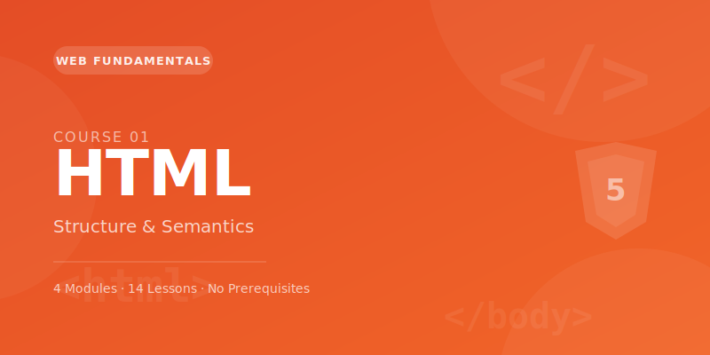
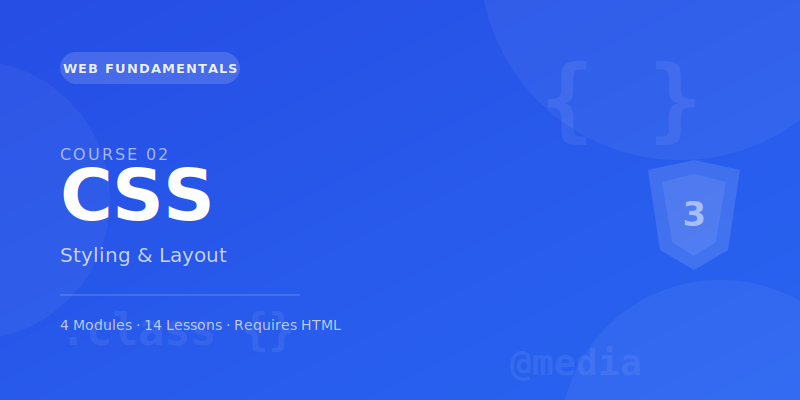
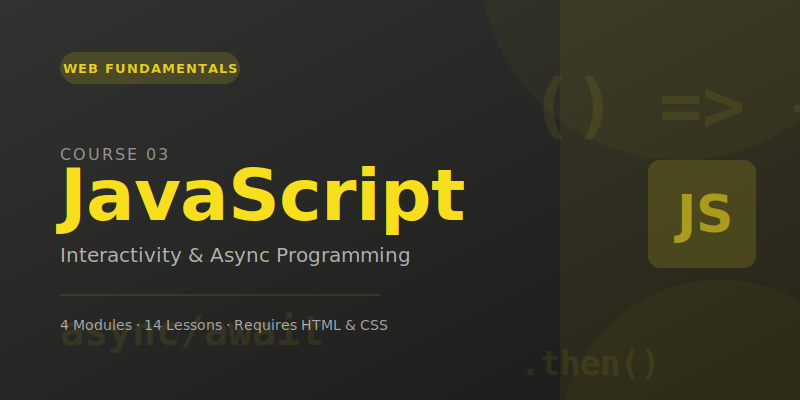
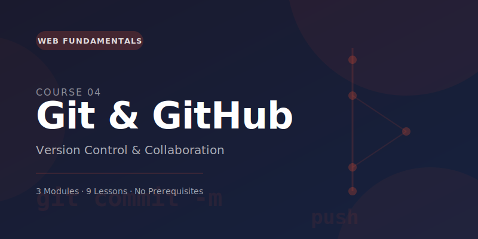
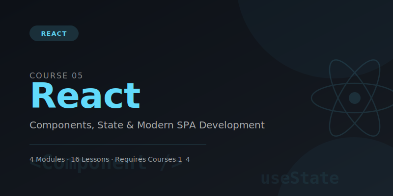
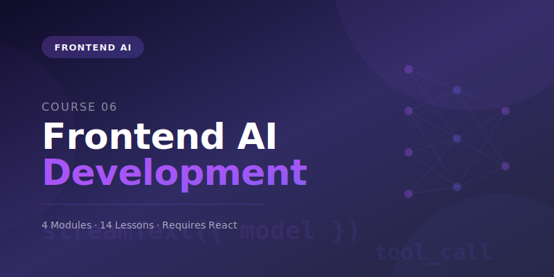

# Course Catalog

---

## Master Sessions

Master sessions are standalone deep-dives delivered to the full cohort, regardless of track. Every learner attends. They cover foundational knowledge that underpins every course in the program.

---

### Master Session 1 — How the Internet Works

| Field | Value |
|---|---|
| Type | Master Session |
| Modules | 5 |
| Total Lessons | 18 |
| Prerequisite | None |

#### Overview

Before writing a single line of HTML, every web developer should understand what actually happens when a URL is typed into a browser. This session walks through the full journey — from keyboard to screen — covering DNS, TCP/IP, HTTP, packets, status codes, and the anatomy of a URL. By the end, learners can explain the web's foundational protocols with confidence.

#### Objectives

By the end of this session you will be able to:

- Describe the roles of clients and servers and how they interact
- Trace the steps of a DNS lookup from browser to authoritative nameserver
- Explain what TCP/IP guarantees and how the three-way handshake works
- Read and write basic HTTP requests and responses
- Identify the most common HTTP status codes and what they mean
- Break down every component of a URL

📄 [Full course notes →](how-the-internet-works.md)

---

### Master Session 2 — Software Development Lifecycle

| Field | Value |
|---|---|
| Type | Master Session |
| Modules | 5 |
| Total Lessons | 20 |
| Prerequisite | None |

#### Overview

Every piece of software is built by following a process. The SDLC is the structured sequence of phases — Plan, Design, Develop, Test, Deploy, Maintain — that takes a vague idea and turns it into a shipped, maintained product. This session covers the full lifecycle, compares methodologies (Waterfall, Agile, Scrum, Kanban, DevOps), and gives learners hands-on practice with the ceremonies and artefacts real teams use every day.

#### Objectives

By the end of this session you will be able to:

- Name and describe each SDLC phase and its key deliverables
- Compare Waterfall and Agile and choose the right fit for a project
- Write user stories with clear acceptance criteria
- Participate in sprint planning, standups, reviews, and retrospectives
- Read a burn-down chart and interpret team velocity
- Explain what CI/CD is and why it matters

📄 [Full course notes →](software-development-lifecycle.md)

---

## Courses

---

## Course 1 — HTML

| Field | Value |
|---|---|
| Track | Web Fundamentals |
| Modules | 4 |
| Total Lessons | 14 |
| Prerequisite | None |

### Overview

HTML (HyperText Markup Language) gives every web page its structure and meaning. Before any styling or interactivity exists, HTML describes what the content is — a heading, a paragraph, a navigation link, a form. This course takes you from writing your first valid document all the way to building fully accessible, validated HTML that meets professional standards.

### Objectives

By the end of this course you will be able to:

- Write a valid HTML5 document from memory
- Use semantic elements to describe page structure with precision
- Build accessible forms that work with keyboard and screen readers
- Mark up lists, tables, figures, and media correctly
- Apply ARIA attributes where HTML semantics are not enough
- Validate your HTML and systematically fix errors

---

## Course 2 — CSS

| Field | Value |
|---|---|
| Track | Web Fundamentals |
| Modules | 4 |
| Total Lessons | 14 |
| Prerequisite | Course 1 — HTML |

### Overview

CSS (Cascading Style Sheets) controls how HTML looks. This course covers everything from the fundamentals of selectors and the box model to Flexbox, CSS Grid, responsive design, animations, and building a maintainable design system with CSS custom properties. Every module builds directly on the previous one.

### Objectives

By the end of this course you will be able to:

- Select any element on a page using any combination of CSS selectors
- Explain the cascade and predict which styles will apply when rules conflict
- Control spacing and sizing using the box model
- Build any layout with Flexbox and CSS Grid
- Write mobile-first responsive CSS with media queries
- Add smooth transitions and keyframe animations
- Build a dark/light theme system with CSS custom properties

---

## Course 3 — JavaScript

| Field | Value |
|---|---|
| Track | Web Fundamentals |
| Modules | 4 |
| Total Lessons | 14 |
| Prerequisite | Course 1 — HTML, Course 2 — CSS |

### Overview

JavaScript makes web pages interactive and dynamic. This course covers the complete language — from variables and data types through functions, the DOM, events, and asynchronous programming. By the end you can build a fully interactive web application that fetches live data from an API, persists state to localStorage, and handles user events — all without a framework.

### Objectives

By the end of this course you will be able to:

- Declare variables and work with all JavaScript data types confidently
- Write functions using declaration, expression, and arrow syntax
- Work with arrays using map, filter, reduce, find, and more
- Manipulate the DOM — select, create, update, and remove elements
- Handle user events including form validation and event delegation
- Write asynchronous code with async/await and Promises
- Fetch data from REST APIs and render it in the browser
- Persist data with localStorage
- Debug JavaScript using Chrome DevTools

---

## Course 4 — Git & GitHub

| Field | Value |
|---|---|
| Track | Web Fundamentals |
| Modules | 3 |
| Total Lessons | 9 |
| Prerequisite | None (runs alongside all other courses) |

### Overview

Git is how professional developers track changes, collaborate without overwriting each other's work, and recover from mistakes. GitHub is where you store code online, share it with the world, and collaborate through pull requests. This course takes you from your very first commit to branching, pull requests, code review, and automated CI pipelines.

### Objectives

By the end of this course you will be able to:

- Initialise a Git repository and make meaningful commits
- Write conventional commit messages that communicate intent
- Push to GitHub and deploy a live site from it
- Work on a feature branch and merge it back via a pull request
- Review code professionally and give constructive feedback
- Undo mistakes safely at every stage
- Set up a GitHub Actions CI pipeline that runs on every push

---

## Course 5 — React

| Field | Value |
|---|---|
| Track | React |
| Modules | 4 |
| Total Lessons | 16 |
| Prerequisite | Courses 1–4 |

### Overview

React is the most widely used frontend framework in the industry. It solves the problem of managing complex, data-driven UIs by letting you describe what the UI should look like for a given state — and letting React figure out how to update the DOM. This course takes you from the first component to a production-quality SPA with routing, global state, live data fetching, form validation, and a professional component library.

### Objectives

By the end of this course you will be able to:

- Explain why React exists and what problem it solves
- Build reusable components with props, conditional rendering, and lists
- Manage local and global state with useState, Context, and Zustand
- Handle side effects and DOM access with useEffect and useRef
- Build multi-page SPAs with React Router v6
- Fetch and cache server data with TanStack Query
- Build and validate forms with React Hook Form and Zod
- Style applications with Tailwind CSS and shadcn/ui

---

## Course 6 — Frontend AI Development

| Field | Value |
|---|---|
| Track | Frontend AI |
| Modules | 4 |
| Total Lessons | 14 |
| Prerequisite | Course 5 — React |

### Overview

This course is what separates your portfolio from everyone else's. You will integrate real AI capabilities into React applications — not as a toy demo, but as production-quality features. You will understand how LLMs work at a practical level, build streaming chat interfaces, engineer effective prompts, analyse images, add voice input, implement tool calling, and learn how AI tools accelerate your own development workflow.

### Objectives

By the end of this course you will be able to:

- Explain tokens, context windows, temperature, and streaming
- Make secure API calls to Claude and GPT-4o via Next.js API routes
- Build streaming chat interfaces with the Vercel AI SDK
- Write system prompts that reliably shape model behaviour
- Build AI-powered product features: smart search, content generation, image analysis
- Add voice input with the Web Speech API
- Implement tool calling so the AI can fetch live data
- Use Claude Code, GitHub Copilot, and v0.dev to build faster
